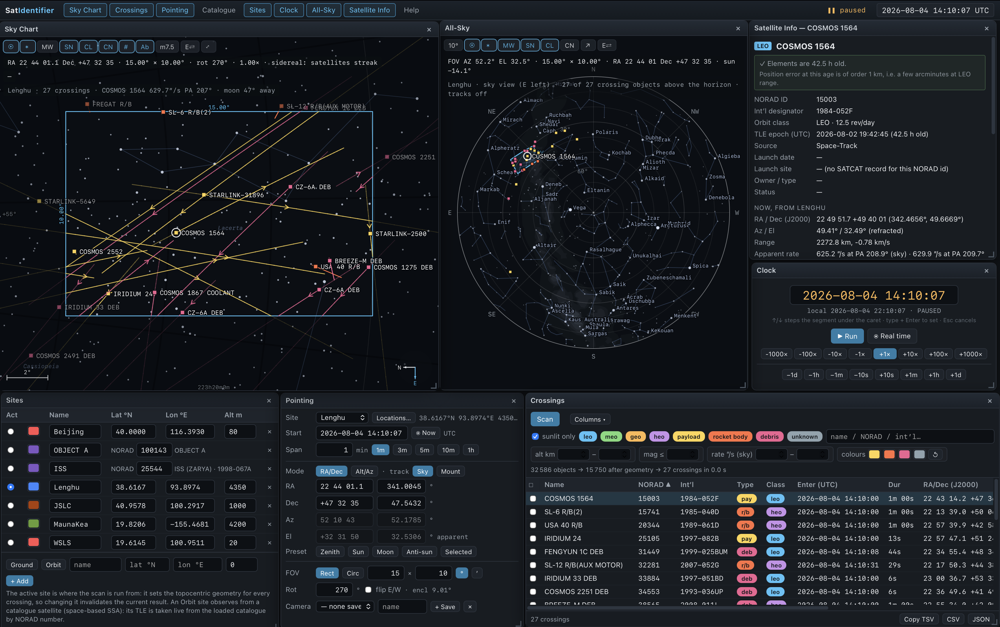

# SatIdentifier

The inverse of a satellite tracker. Instead of asking *where is this satellite*, it
asks **who is in my field of view** — so an unidentified trail on a frame can be
matched against the catalogue.

Give it a site, an epoch and a timespan, a pointing (RA/Dec J2000, Alt/Az, or LVLH
angles from orbit) and a field of view. It finds every catalogued object that
crosses that field and draws each trail on a gnomonic sky chart over a real star
background, directly comparable against your frame.

The site itself can be a **satellite** (space-based SSA): pick any object in the
loaded catalogue by NORAD number and the scan runs from *its* sensor — who crosses
my field, seen from orbit.



Local Python backend (catalogue fetching, caching, persistence — standard library
only) + browser frontend (SGP4 in Web Workers, canvas chart). Companion to
[SatObserver-MX](../satobserver), sharing its architecture and its house style.

Module APIs are in [CONTRACT.md](CONTRACT.md); how it was built and what was
measured is in [DEVLOG.md](DEVLOG.md).

## Upstream and modifications

This repository is a modified distribution of
[SatIdentifier](https://github.com/exoplanet5/SatIdentifier), originally created
by Zhuoxiao. The upstream project is licensed under the MIT License; the
original copyright and license notice are retained in [LICENSE](LICENSE).

This fork adds and changes satellite-occultation planning and event-search
features, together with related native-window and headless workflows, tests,
and documentation. These changes are maintained separately from the upstream
project. See [NOTICE.md](NOTICE.md) for the attribution and third-party notices.

## Requirements

**Packaged app** (in `release/`) — no runtime dependencies; Python and the star
catalogue are bundled. Network access is needed for catalogue fetching (cached
data works offline). A free [space-track.org](https://www.space-track.org)
account is required for the full catalogue (saved locally on first use).

- **macOS** (`SatIdentifier-macOS-arm64.zip`): Apple Silicon. Unsigned — first
  launch on another machine needs right-click → Open once. User data lives in
  `~/Library/Application Support/SatIdentifier/`.
- **Windows** (`SatIdentifier-windows-x64.zip`, when present): produced by CI on
  a Windows runner, **untested on real hardware** — the same caveats as
  SatObserver-MX's Windows build apply.

**To run from source** (browser mode):
- Python ≥ 3.10 — **standard library only**, no packages needed
- Any modern browser (developed against Chrome; the packaged app uses WKWebView)

**To rebuild the .app**:
`python3 -m venv .venv-build && .venv-build/bin/pip install pywebview pyinstaller`
(icon regeneration additionally needs `pillow`), then:

```sh
.venv-build/bin/pyinstaller --noconfirm --clean --windowed \
  --name "SatIdentifier" --icon build_icon/SatIdentifier.icns \
  --add-data "app:app" --osx-bundle-identifier "local.satidentifier" desktop.py
```

## Run

**macOS app**: unzip `release/SatIdentifier-macOS-arm64.zip`, double-click
`SatIdentifier.app`. Native window; closing it quits.

**Dev / browser mode**:

```sh
python3 server.py
```

Starts a local server on http://127.0.0.1:8476 and opens your browser.
Options: `--port N`, `--no-browser`. Or double-click `SatIdentifier.command`.
In dev mode data lives in `./data/`.

**Source native-window mode** (the same pywebview interface as the packaged app):

```sh
python3.13 -m venv .venv
.venv/bin/python -m pip install pywebview
python3 desktop.py
```

This starts the local server inside a pywebview/WKWebView window rather than
opening an external browser. The complete occultation search is available in
this mode when Node.js is installed; it runs outside the WebView and streams
progress back to the original Plan window. `SatIdentifier.command` prefers this
mode automatically when pywebview is available.

## Workflow

1. **Catalogue** — press *Load full catalogue* (Space-Track full GP; a free account
   is required and saved locally). Add CelesTrak single-object queries (NORAD /
   COSPAR / name-contains, no account needed — the same tab also downloads the full
   SATCAT metadata table), McCants classified elements, or paste TLEs — everything
   merges into one catalogue, deduplicated by NORAD with the newest elements
   winning, and **epoch-age statistics are shown per source**, because stale
   elements are the main cause of a failed identification.
2. **Sites** — add your observing site and mark it active. Two kinds: **Ground**
   (lat / lon / alt) or **Orbit** (an observing satellite, picked from the loaded
   catalogue by NORAD number or name — the TLE is resolved live from the
   catalogue, so the observer can never go stale against the targets).
3. **Pointing** — start time, timespan, pointing, field of view.
4. **Crossings** — press *Scan*.
5. **Sky Chart** — compare the trails against your frame.

## Nightly satellite-occultation search (P0-11)

The occultation workflow is separate from the ordinary *Crossings* scan:

1. Load the catalogue in **Catalogue** and make a ground site active in **Sites**.
2. Open **Occultation Plan**, choose the local date and IANA time zone, then set
   the twilight altitude, minimum satellite elevation, the SatIdentifier scan tags
   (`leo`, `meo`, `geo`, `heo`, `payload`, `rocket body`, `debris`), star magnitude
   limit, search corridor, effective satellite radius, and **Contacts only**. The
   classification filters are applied during pass scanning
   and remain available for a second filter in the Events table. The last
   option is enabled by default and keeps only complete geometric contacts or
   grazes in the published event table; misses are still counted in the run
   statistics.
3. Press **Run occultation search**. In the native app, the original Plan
   window remains the interface while the full calculation runs in a separate
   Node process. Results appear in **Occultation Events**; click an event row to
   pause at closest approach and focus the main **Sky Chart**, where the target
   star, satellite, and the adjacent time-ordered passing track are marked. The
   displayed track grows with the event duration and is clipped to the pass
   bounds. The event table includes closest-approach Alt/Az and sortable
   quantitative columns such as separation, size, duration, and geometry.
   **Occultation Chart** remains available for the detailed tangent-plane path
   view.
4. **Contacts only** is enabled by default. The native run removes the
   interactive 5,000-candidate cap, processes crossings one at a time, and
   reports both the raw candidate count and the exact candidates evaluated.
   Misses are counted but are not copied into the event table. The browser-only
   Pass/Candidate limit fields do not cap the native complete run.

### Browser-independent complete search

For a full-catalogue run, use the headless process so the calculation is not
held inside a browser tab:

```sh
node tools/run_occultation_headless.js \
  --date 2026-08-06 \
  --timezone Australia/Melbourne \
  --lat -37.7966 --lon 144.9633 --alt 50
```

Add `--tags leo,payload` or use `--classes leo,meo,geo,heo` and/or
`--types PAY,R/B,DEB` to apply the same SatIdentifier scan-tag filters in the
headless search.

It uses the same P0-11 SGP4 and contact solver, streams each crossing through a
bounded 512-point path, removes the interactive 5,000-candidate cap, and writes
JSON/CSV results under `data/occultation-results/`. The original pywebview Plan
window is the UI; Node performs the calculation outside WebKit and sends back
stage progress. A small Tk controller is also available with
`python3 occultation_gui.py`.

## Observing from orbit (space-based SSA)

With an Orbit site active, the same pipeline answers "who crosses my sensor's
field" for a satellite-mounted instrument:

- **Az/El become LVLH angles** (labelled AzL/ElL): Az from the along-track
  (velocity) direction toward the orbit normal, El from the local horizontal
  toward zenith (radially out; −90° = nadir). The *Mount* tracking mode becomes
  **LVLH** — a body-fixed staring sensor, drifting through the stars at the
  orbital rate exactly as a parked ground mount drifts at the sidereal rate.
- **Earth-limb occlusion replaces the horizon**: a target is dropped only while
  the line of sight passes through the Earth itself, and entry/exit times resolve
  a target *rising from behind the limb* the same way they resolve a field edge.
  No refraction, ever, in orbit.
- The observer **never identifies itself**, and its own TLE error is added to the
  match tolerance — at the sensor it is indistinguishable from the target's.
- All-Sky is a ground-horizon projection and says so on an Orbit site; the Sky
  Chart works for both kinds.

The soundness proofs run over orbital geometry too: the geometric cull returns
the identical crossing set with the cull disabled, and every reported position
agrees with an independent two-body recompute to ~0.01″ (see `tools/test_scan.js`
section [o]).

## What it computes

- **Crossings**: entry / closest-approach / exit times, separation, RA/Dec (J2000),
  Az/El, range, range rate, angular rate and position angle, estimated magnitude,
  sunlit/penumbra/umbra, orbit class, TLE age.
- **Two angular rates**, because which one streaks your exposure depends on how you
  were tracking. Against the **stars** (`d(RA,Dec)/dt`) is the streak on a
  sidereally-guided frame — note a geostationary object is *not* stationary here, it
  drifts at ~15″/s, which is why GEO streaks in tracked images. Against the
  **horizon** (`d(alt,az)/dt`) is what a parked mount sees, where GEO is a fixed dot
  and the stars trail instead — on an Orbit site this second rate is measured
  against the LVLH frame, i.e. what a body-fixed staring sensor records. The chart
  draws whichever matches your tracking mode, including the field rotation a parked
  mount sees, and the trail drawn across the field between entry and exit is the
  thing to hold up against your frame.
- **Adaptive star background** on the sky chart: the depth follows the field.
  Views narrower than 3° draw **Gaia DR3 down to V = 17** from a local tiled star
  database (`data/stars17/`, ~45M stars — build it once with
  `python3 tools/make_starcat.py --deep17`; no network is ever touched at runtime,
  and for the packaged app the tile directory belongs in its data folder, e.g.
  `~/Library/Application Support/SatIdentifier/stars17/` on macOS). Wider views
  draw from the bundled catalogue (Gaia DR3 to V = 10.5, 549 037 stars, proper
  motions applied; BSC5/HYG photometry at the bright end), shedding depth as the
  field grows — m 10.5 at 3° down to m 4.5 at ≥ 48° — so a wide chart never drowns
  in stars. The toolbar button pins a fixed limit instead; without the deep build,
  narrow fields quietly fall back to the bundled catalogue and the footer says so.
  Star dots follow **Stellarium's rendering law** (`StelSkyDrawer::computeRCMag`,
  adapted): flux-law radius for the bright and middle magnitudes, and below a 1 px
  floor the dot stops shrinking and *fades* — cubic luminance falloff to a cutoff —
  so a deep field grades smoothly to invisibility at the limit instead of ending in
  uniform minimum-size dots. Milky Way, Sun/Moon (with lunar phase) and
  constellation-name overlays each keep their own toggle. The **All-Sky panel**
  uses the bright-star set only (V ≤ 4.6, as SatObserver), with the same Milky Way
  and Sun/Moon toggles. Neither view tints its background with twilight or
  daylight.

## Accuracy — read this before trusting an identification

Frame handling is deliberately careful, because the tool compares satellite positions
against a star field:

- Coordinates are **J2000 mean equinox**. SGP4 returns TEME, which is *not* J2000 —
  precession since J2000 is **0.36° in 2026**, twenty times a typical telescope field.
  The full TEME → J2000 rotation (IAU-1976 precession, IAU-1980 nutation, equation of
  the equinoxes) is applied. Verified against satellite.js's own alt/az path over 1102
  samples spanning LEO/HEO/GEO and four sites: agreement **1.4e-5 arcsec**.
- Refraction is always applied to Alt/Az (1.7′ at El 30°, 5.4′ at El 10°), and the
  inverse is solved by iteration so mode switching is exactly reversible.

**But the frames are not the limiting error — the elements are:**

| Term | Magnitude | Applied? |
|---|---|---|
| TLE position error (fresh → a week old) | ~1–20 km ⇒ **7′–2°** at 500 km range | irreducible |
| UT1−UTC ignored by default | ≤ 0.9 s ⇒ **≤ 2.9′** | optional `DUT1` setting |
| Refraction | 1.7′ at El 30°, 5.4′ at El 10° | always applied |
| Annual aberration | ≤ 20.5″ | no — see below |
| Light time + orbital aberration (Orbit sites) | ≤ ~5″ each | no — two orders under TLE slop |
| Precession + nutation | < 1″ | **yes** |

Aberration is applied to neither satellites nor stars, so the chart and the objects
stay mutually consistent; correcting one side alone would make things worse. TLE age
is shown per row and in Satellite Info, because it is the number that decides whether
an identification is believable.

**Magnitudes are estimates, and mostly priors.** The method is shown per row:

| Method | Meaning |
|---|---|
| `qsmag` | McCants standard magnitude — a real observed value |
| `rcs` | Diffuse sphere from the SATCAT radar cross-section |
| `model` | Documented constellation brightness (Starlink, OneWeb) |
| `type` | Size class from SATCAT object type (R/B ≫ PAY ≫ DEB) |
| `default` | 1 m sphere. A guess, flagged as one |

Two data facts make the lower tiers necessary rather than optional: **CelesTrak
publishes no RCS above NORAD 50000** (measured: 41–97% coverage below 40000, 25.6% for
40000–49999, 0.0% above 50000), and **mmccants.org/programs/qsmag.zip currently
returns HTTP 404**. On a modern catalogue most objects therefore land on a prior with
a magnitude or more of real scatter. Do not read the magnitude column as photometry.

## Repository layout

```
server.py                  Python 3 stdlib-only backend: static files + JSON API
desktop.py                 pywebview shell for a native window
SatIdentifier.command      double-click launcher (dev mode)
app/
  index.html               loads CSS + scripts in a fixed order
  css/app.css              the whole design system, dark theme
  assets/stars_deep.bin    Gaia DR3 to V=10.5, 549 037 stars, 5.5 MB (preferred)
  assets/stars_m9.bin      Tycho-2 to V=9.0, 130 183 stars, 1.3 MB (fallback)
  js/frames.js             coordinate frames, precession/nutation, refraction, TAN
  js/propagate.js          SGP4 wrapper and the topocentric solution
  js/scan.js               worker pool, merge, budgeting
  js/worker/scan-worker.js the three-stage scan engine
  js/stars.js              deep star catalogue, cone queries
  js/photometry.js         five-tier magnitude model, Earth shadow
  js/chart.js              gnomonic sky chart (main view)
  js/crossings.js          crossings table (main list)
  js/pointing.js           the input window
  js/allsky.js             all-sky context view with the FOV footprint
  js/state.js  util.js  clock.js  windows.js  sources.js  locations.js  satinfo.js
tools/
  make_starcat.py          builds the star catalogue asset; --deep17 builds the
                           local V=17 tile set into data/stars17/ (gitignored)
  test_*.js                verification harnesses — see DEVLOG
docs/                      screenshot
data/                      state, caches, credentials, deep star tiles (gitignored)
```

## Credits

Propagation: [satellite.js](https://github.com/shashwatak/satellite-js) (SGP4/SDP4).
Stars: Gaia DR3 (Gaia Collaboration 2022) and Tycho-2 (Hog+ 2000) via VizieR, plus
BSC5/HYG bright-star photometry by way of
[d3-celestial](https://github.com/ofrohn/d3-celestial). Catalogue data: CelesTrak,
Space-Track, Mike McCants. The scan's structure — hoisting SGP4 init out of the time
loop, rotating the pointing rather than the catalogue, and gating expensive work
behind a cheap scalar test — is taken from Bill Gray's
[sat_code](https://github.com/Bill-Gray/sat_code); the precession handling follows the
reasoning in his `lunar/precess.cpp`. Problem framing owes a debt to
[SatSkyMap](https://github.com/lnicastro/SatSkyMap).
